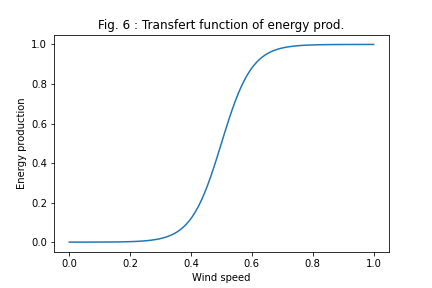

Economical value of weather forecasting
=======================================

Author: Olivier Pannekoucke INPT-ENM/CNRM/CERFACS

   &nbsp;&nbsp;&nbsp;&nbsp;&nbsp;&nbsp;

This work illustrates the economical value of weather forecasting applied to a simulated wind power plant production.

**Assymetric penalties to protect electricity networks**

Since renewable energy production is sensitive to the weather, it implies strong variation of the energy delivered on the transport system. In particular, too much power generation can damage power lines.

In order to secure the distribution lines, the producers have to determine the electricity production, $PE_c$, one day in advance in order to write it in the contract with the electricity network manager. 

Assymetric penalties are introduced to avoid underestimation of the real power production obsersved $PE$,
$$L(PE_c,PE) = k_1 (PE-PE_c)^+ + k_2 (PE_c-PE)^+.$$

**A simulated renewable wind power plant** 

A synthetic production line is introduced that mimic realistic production system of forecast, with a nature and a numerical model that modelized the nature (with some errors). The wind power plant transforms the wind energy into electricity following a transfert function

Codes for this simulated framework are given in the companion package [valeco](./valeco/).

**Uncertainty prediction of the weather forecast**

In particular,  the nature we consider is sensitive to initial errors, which illustrates the need to take into account the uncertainty of the forecast.

**Strategy of the producer**

To save money, a generator needs to develop strategies that account for weather uncertainty to better specify the $PE_c$ electricity output it should write to its contract.

Several strategies are presented in the [notebook](./study_optimization-wind-power-prediction.ipynb), then evaluated in this testbed.

**Requirements**

 * numpy
 * sklearn
 * sympkf

**Warning**

This material is intended for educational purposes only. The codes cannot be used for operational purposes. 

Licence: [CeCILL-B](./LICENCE.txt)